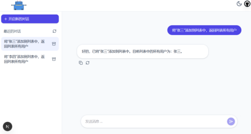

### 与 Deepseek 对话流式输出，包含完整前后端
* 会话列表管理：新建、保存、归档
* 对话记录管理：停止、重新生成、新建会话
* 对话记忆管理：存储、展示对话记忆
* 记忆库支持：内存、mysql、图neo4j、向量库

### 项目启动
Step1: 启动ai-service/streaming-ai-service

Step2: 启动springai-chat-ui-chapter4

